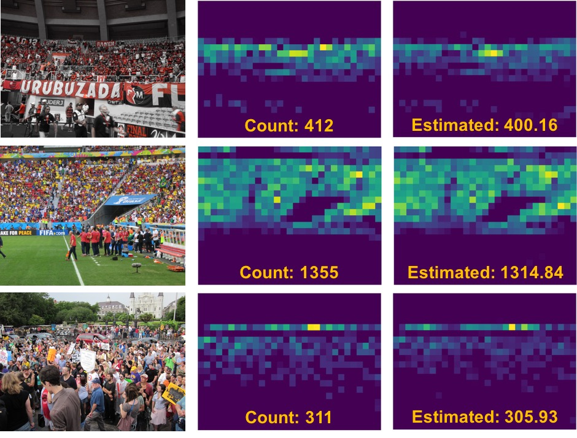

# ECCV2020: Adaptive Mixture Regression Network with Local Counting Map for Crowd Counting


### Introduction
In this work, we introduce a new learning target named local counting map, and
show its feasibility and advantages in local counting regression. Meanwhile, we
propose an adaptive mixture regression framework in a coarse-to-fine manner.
It reports marked improvements in counting accuracy and the stability of the
training phase, and achieves the start-of-the-art performances on several author-
itative datasets. For more details, please refer to our [arXiv paper](https://arxiv.org/abs/2005.05776).


### Demo


### Prerequisites
  - Python >= 3.5
  - Pytorch >= 1.0.1
  - other libs in ```requirements.txt```, run ```pip install -r requirements.txt```.

### Models
QNRF-model (MAE/MSE: 86.6/152.1):

Google Drive: [download link](https://drive.google.com/open?id=1btZa7ltAwqQe0CDa41P67EtTdY0iJOfh),
Baidu Yun: [download link](https://pan.baidu.com/s/1humECw3oz4xRbWy5CaakZQ) (key: pe2r) 

### Run
- ```python demo.py```.
- results are saved at ```./images/results```.

